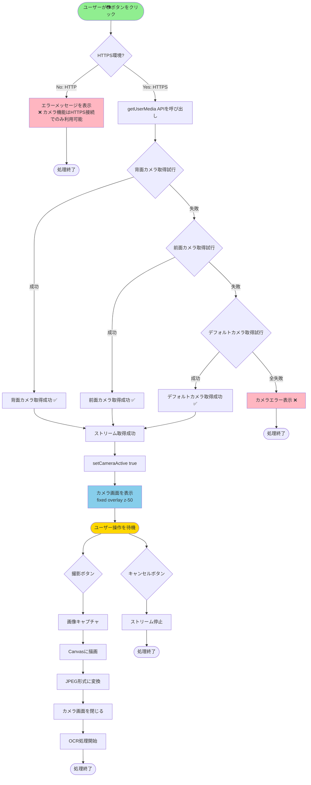
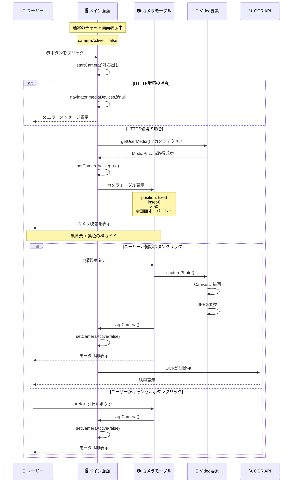

# 📷 カメラ機能 - 詳細フロー図

## カメラ起動の全体フロー



## 画面遷移の詳細

### ✅ ページ遷移は**しません**（モーダル表示）



## UI構造の詳細

### 通常画面（cameraActive = false）
```
┌─────────────────────────────────────────────────┐
│ 📷 カメラ認証AI         書類認証・データ抽出     │
├─────────────────────────────────────────────────┤
│                                                 │
│  🤖 こんにちは！カメラ認証AIです。              │
│     📋 手順:                                    │
│     1. CSVファイルをアップロード...            │
│                                                 │
│  👤 ユーザーメッセージ...                       │
│                                                 │
├─────────────────────────────────────────────────┤
│  [読み込み完了]  📷  📎  [入力]  ➡️          │
└─────────────────────────────────────────────────┘
```

### カメラ画面表示時（cameraActive = true）
```
┌─────────────────────────────────────────────────┐
│ ███████████████████████████████████████████████ │
│ █                                             █ │
│ █   📄 書類を枠内に配置してください              █ │
│ █                                             █ │
│ █       ┌──────────────────────┐              █ │
│ █       │ ┌──────────────────┐ │              █ │
│ █   ▓▓▓ │ │                  │ │ ▓▓▓▓        █ │
│ █   ▓▓▓ │ │   カメラ映像      │ │ ▓▓▓▓        █ │
│ █   ▓▓▓ │ │  (紫色の枠ガイド) │ │ ▓▓▓▓        █ │
│ █   ▓▓▓ │ │                  │ │ ▓▓▓▓        █ │
│ █       │ └──────────────────┘ │              █ │
│ █       │ ここに文字を合わせて    │              █ │
│ █       │    ください          │              █ │
│ █       └──────────────────────┘              █ │
│ █                                             █ │
│ █               [📸]  [❌]                    █ │
│ █                                             █ │
│ ███████████████████████████████████████████████ │
└─────────────────────────────────────────────────┘
     ↑ 全画面固定オーバーレイ（z-50）
```

## コードの実行順序

```javascript
// 1. ボタンクリック
onClick={startCamera}

// 2. カメラ起動関数
const startCamera = async () => {
  // 2-1. HTTPSチェック
  if (!navigator.mediaDevices || !navigator.mediaDevices.getUserMedia) {
    // エラー表示 → 終了
    return;
  }
  
  // 2-2. カメラ取得（3段階フォールバック）
  let stream;
  try {
    stream = await navigator.mediaDevices.getUserMedia({ 
      video: { facingMode: "environment" }  // 背面
    });
  } catch (e1) {
    try {
      stream = await navigator.mediaDevices.getUserMedia({ 
        video: { facingMode: "user" }  // 前面
      });
    } catch (e2) {
      stream = await navigator.mediaDevices.getUserMedia({ 
        video: true  // デフォルト
      });
    }
  }
  
  // 2-3. Video要素にストリーム設定
  videoRef.current.srcObject = stream;
  streamRef.current = stream;
  
  // 2-4. State更新 → UI表示
  setCameraActive(true);
}

// 3. State更新によりレンダリング
{cameraActive && (
  <div className="fixed inset-0 bg-black z-50">
    <video ref={videoRef} autoPlay playsInline muted />
    {/* ガイドラインUI */}
    <button onClick={capturePhoto}>📸</button>
    <button onClick={stopCamera}>❌</button>
  </div>
)}

// 4. 撮影処理
const capturePhoto = () => {
  canvas.width = video.videoWidth;
  canvas.height = video.videoHeight;
  ctx.drawImage(video, 0, 0);
  const url = canvas.toDataURL("image/jpeg", 0.95);
  stopCamera();
  processImage(url);  // OCR処理開始
}
```

## 重要なポイント

### ✅ ページ遷移なし
- `cameraActive` stateで制御
- `position: fixed, inset-0, z-50`で全画面オーバーレイ
- **URLは変更しない**

### 📍 State管理
```javascript
const [cameraActive, setCameraActive] = useState(false);

// false → true: カメラモーダル表示
// true → false: カメラモーダル非表示
```

### 🎯 メイン画面との関係
```
通常画面: チャット履歴 + 入力フォーム
     ↓
📷ボタンクリック
     ↓
全画面オーバーレイ表示（通常画面の上に重ねる）
     ↓
カメラ映像 + 撮影ボタン
     ↓
撮影完了 or キャンセル
     ↓
元の通常画面に戻る（URL変わらず）
```

## デバイス対応

### 📱 iOS Safari
- ✅ `playsInline` → インライン再生
- ✅ `muted` → 音声オフ（必須）
- ⚠️ `facingMode` 非対応可能性 → フォールバックあり

### 🤖 Android Chrome
- ✅ すべての機能対応
- ✅ `facingMode: "environment"` で背面カメラ優先

### 💻 PC Chrome/Safari
- ✅ すべての機能対応
- ✅ `facingMode: "environment"` は無視される

## エラーハンドリング

### エラーパターン1: HTTTP環境
```
❌ カメラ機能はHTTPS接続でのみ利用可能です。
現在HTTPでアクセスしているため、カメラを使用できません。
```

### エラーパターン2: カメラ権限拒否
```
❌ カメラ権限を許可してください。
```

### エラーパターン3: カメラ未接続
```
❌ カメラエラー: [エラー詳細]
```

## まとめ

| 項目 | 詳細 |
|------|------|
| **ページ遷移** | ❌ なし（モーダル表示） |
| **画面構造** | 全画面固定オーバーレイ |
| **URL変更** | ❌ 変更なし |
| **State管理** | `cameraActive` boolean |
| **終了方法** | 撮影完了 or キャンセル |
| **HTTPS必須** | ✅ 必須 |


