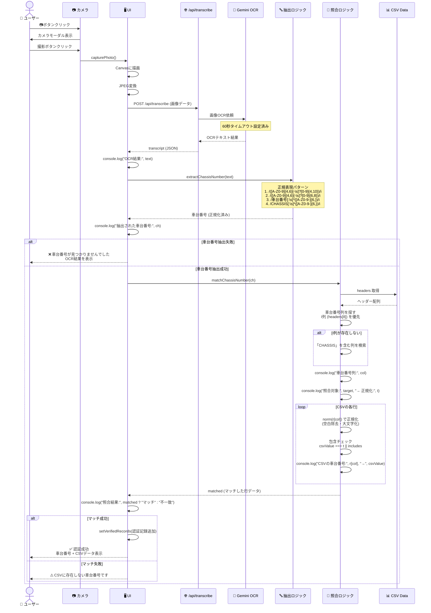

# 🔍 OCR → 照合フロー詳細

## 現在の実装フロー



## 重要な関数

### 1. parseCSV (35-61行目)
```typescript
const parseCSV = (text: string): CsvData => {
  const lines = text.split("\n").filter(l => l.trim());
  const headerLine = lines[2];  // 3行目がヘッダー
  const headers = headerLine.split(",").map(h => h.trim());
  
  const rows: Record<string, string>[] = [];
  for (let i = 3; i < lines.length; i++) {  // 4行目以降がデータ
    const values = lines[i].split(",").map(v => v.trim());
    const row: Record<string, string> = {};
    headers.forEach((h, idx) => { row[h] = values[idx] || ""; });
    rows.push(row);
  }
  return { headers, rows };
};
```

### 2. extractChassisNumber (144-158行目)
```typescript
const extractChassisNumber = (text: string): string | null => {
  const patterns = [
    /([A-Z0-9]{4,6}[-\s]?[0-9]{4,10})/i,  // HNT32 -117910対応
    /([A-Z0-9]{4,6}[-\s]?[0-9]{6,8})/i,
    /車台番号[:\s]*([A-Z0-9-]{6,})/i,
    /CHASSIS[:\s]*([A-Z0-9-]{6,})/i,
  ];
  for (const p of patterns) { 
    const m = text.match(p); 
    if (m) return m[1].replace(/\s/g, "").toUpperCase(); 
  }
  return null;
};
```

### 3. matchChassisNumber (64-86行目)
```typescript
const matchChassisNumber = (target: string): Record<string, string> | null => {
  if (!csvData) return null;
  const headers = csvData.headers;
  
  // I列（インデックス8）を優先、なければCHASSIS列を検索
  const col = headers[8] || headers.find(h => 
    h.includes("車台番号") || 
    h.toUpperCase().includes("CHASSIS") || 
    h.toUpperCase().includes("VIN")
  );
  
  if (!col) return null;
  
  // 正規化関数（空白除去・大文字化）
  const norm = (s: string) => s.replace(/\s/g, "").toUpperCase();
  const t = norm(target);
  
  // CSVデータと照合（包含チェック対応）
  const matched = csvData.rows.find(r => {
    if (!r[col]) return false;
    const csvValue = norm(r[col]);
    return csvValue === t || csvValue.includes(t) || t.includes(csvValue);
  });
  
  return matched || null;
};
```

### 4. processImage (160-195行目)
```typescript
const processImage = async (imageDataUrl: string) => {
  setLoading(true);
  try {
    // 1. CSVチェック
    if (!csvData) {
      setMessages([...messages, { 
        role: "assistant", 
        content: "⚠️ 先にCSVをアップロードしてください。" 
      }]);
      return;
    }
    
    // 2. OCR処理
    setMessages([...messages, { 
      role: "assistant", 
      content: "⏳ 画像OCR中..." 
    }]);
    
    const blob = await (await fetch(imageDataUrl)).blob();
    const file = new File([blob], "capture.jpg", { type: "image/jpeg" });
    const fd = new FormData(); 
    fd.append("file", file);
    
    const res = await fetch("/api/transcribe", { method: "POST", body: fd });
    if (!res.ok) throw new Error("OCR失敗");
    
    const data = await res.json();
    const text = String(data.transcript || "");
    
    // 3. 車台番号抽出
    console.log("OCR結果:", text);
    const ch = extractChassisNumber(text);
    console.log("抽出された車台番号:", ch);
    
    if (!ch) {
      setMessages([...messages, { 
        role: "assistant", 
        content: `❌ 車台番号が見つかりませんでした。\n\nOCR結果:\n${text.substring(0, 200)}...` 
      }]);
      return;
    }
    
    // 4. CSV照合
    const matched = matchChassisNumber(ch);
    
    if (matched) {
      setVerifiedRecords([...verifiedRecords, { 
        chassisNumber: ch, 
        timestamp: new Date().toISOString(), 
        matchedData: matched 
      }]);
      const disp = Object.entries(matched).map(([k, v]) => `${k}: ${v}`).join("\n");
      setMessages([...messages, { 
        role: "assistant", 
        content: `✅ 認証成功\n\n車台番号: ${ch}\n\n${disp}` 
      }]);
    } else {
      setMessages([...messages, { 
        role: "assistant", 
        content: `⚠️ CSVに存在しない車台番号です: ${ch}` 
      }]);
    }
  } catch (e) {
    setMessages([...messages, { 
      role: "assistant", 
      content: `❌ エラー: ${(e as Error).message}` 
    }]);
  } finally {
    setLoading(false);
  }
};
```

## 照合ロジックの詳細

### 正規化処理
```typescript
const norm = (s: string) => s.replace(/\s/g, "").toUpperCase();
```
- すべての空白文字を除去
- 大文字に変換
- 例: `HNT32 -117910` → `HNT32-117910`
- 例: `abc123 def` → `ABC123DEF`

### 照合パターン
```typescript
csvValue === t || csvValue.includes(t) || t.includes(csvValue)
```

1. **完全一致**: `csvValue === t`
   - `ABC123` === `ABC123` ✅

2. **CSV側が長い**: `csvValue.includes(t)`
   - `ABC123-XYZ` に `ABC123` が含まれる ✅

3. **抽出側が長い**: `t.includes(csvValue)`
   - `ABC123-XYZ` に `ABC123` が含まれる ✅

### CSV列の優先順位

1. **I列 (headers[8])**: インデックス8の列を直接指定
2. **フォールバック**: 列名に「車台番号」「CHASSIS」「VIN」を含む列を検索

## デバッグログの出力順序

1. `OCR結果: [Geminiからのテキスト]`
2. `抽出された車台番号: [正規化済み]`
3. `CSVヘッダー: [列名配列]`
4. `車台番号列: [列名] (I列)`
5. `照合対象: [元の値] → 正規化: [正規化後]`
6. `CSVの車台番号: [元の値] → 正規化: [正規化後]` (各行)
7. `照合結果: マッチ` or `照合結果: 不一致`

## 問題点と対応

### 現在の問題
- **Gemini API接続タイムアウト**: 60秒設定済みだが、ネットワーク環境による

### 既に実装済み
- ✅ 正規化処理（空白・改行無視）
- ✅ I列優先照合
- ✅ 包含チェック（部分一致対応）
- ✅ デバッグログ出力
- ✅ エラーハンドリング


