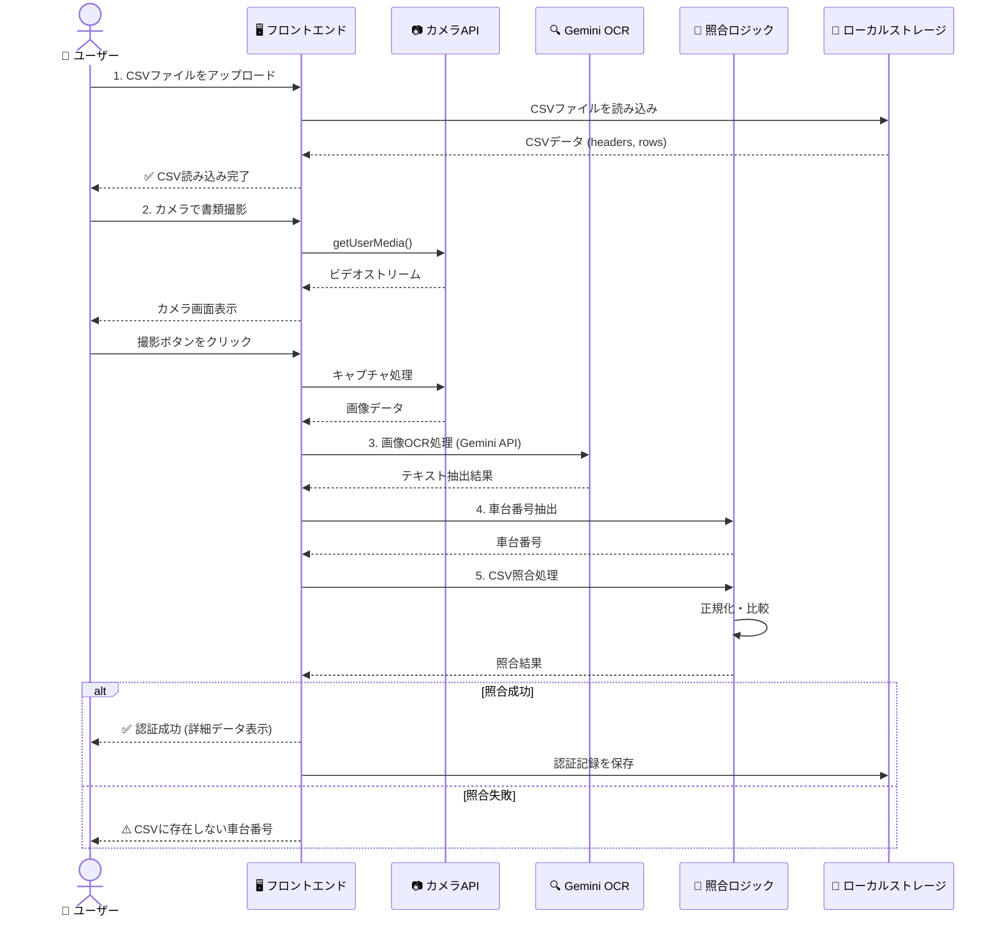
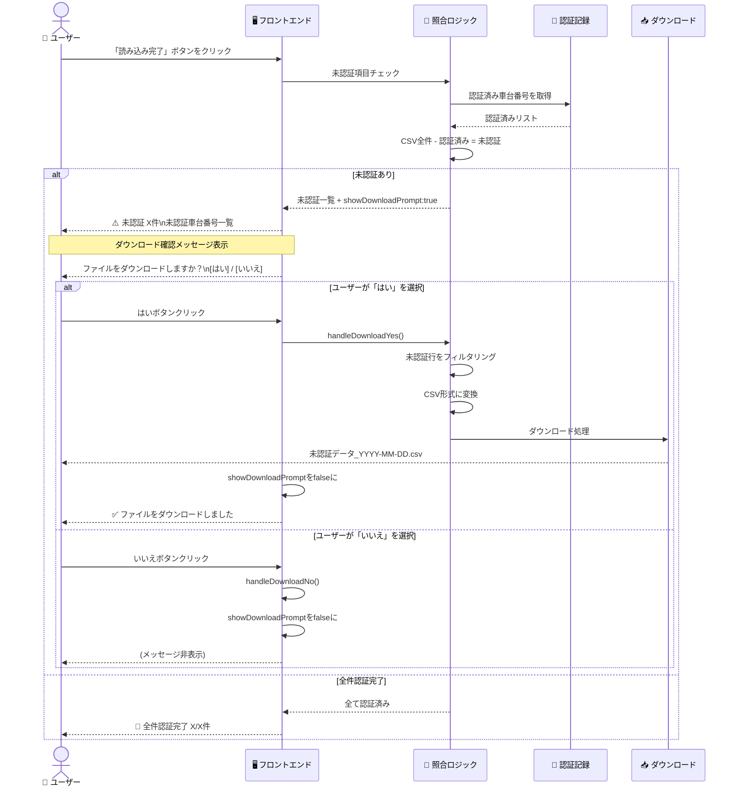
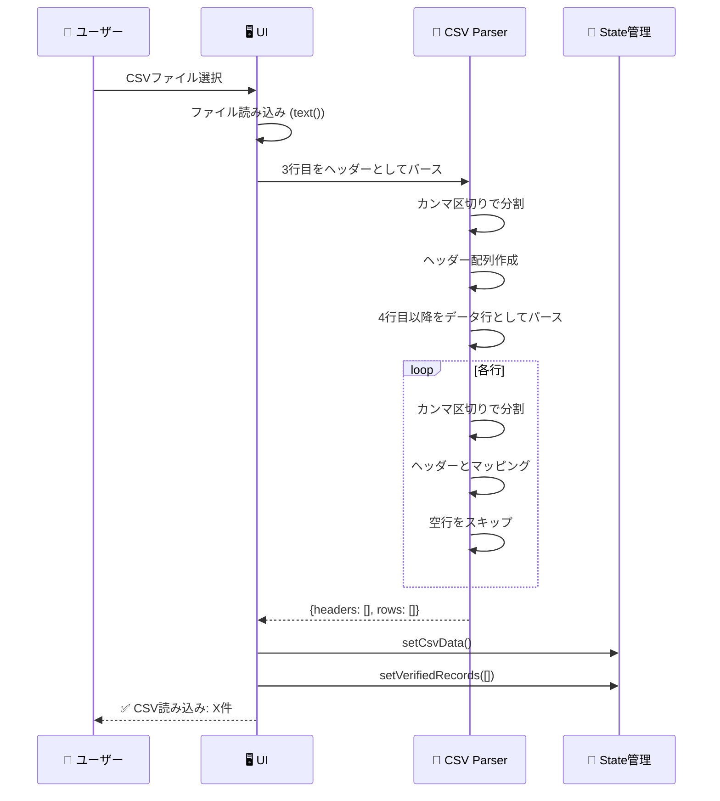
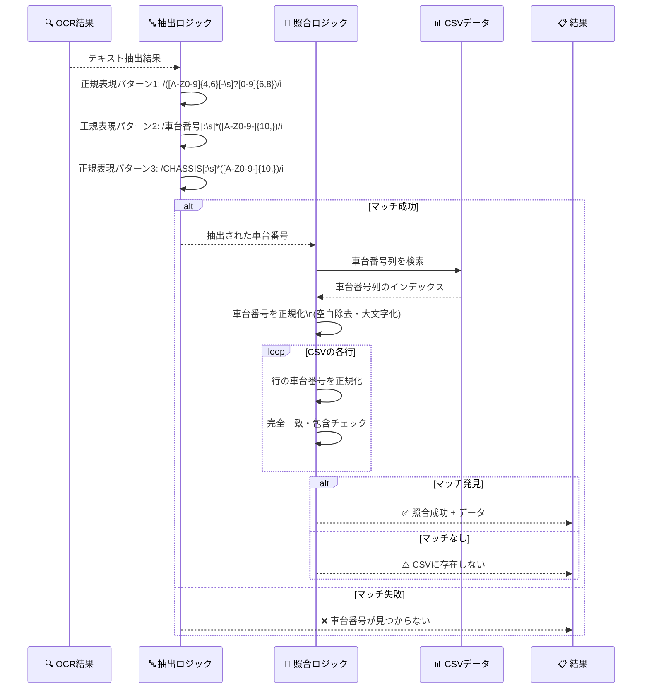
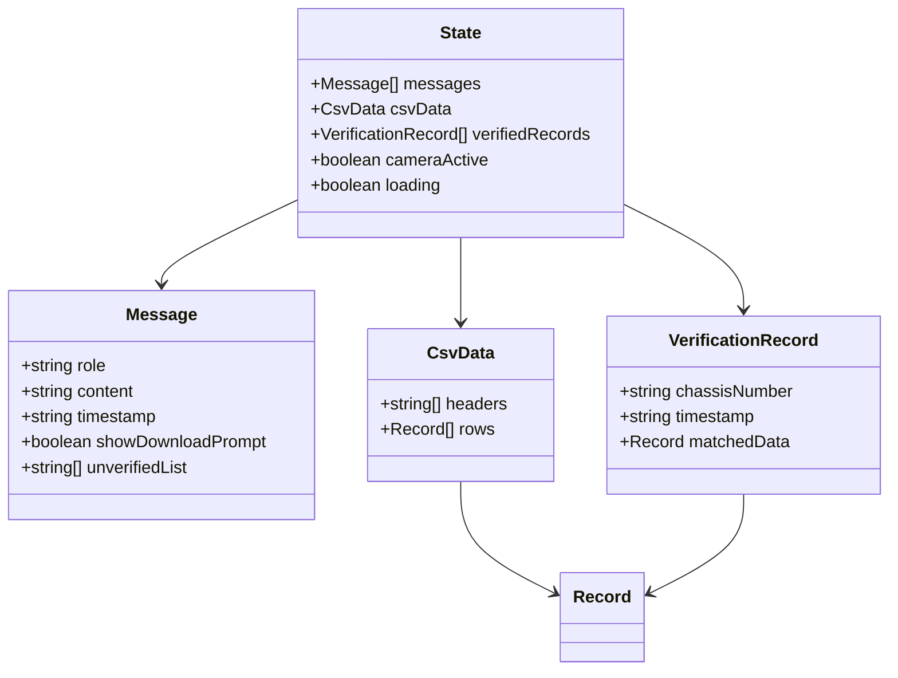
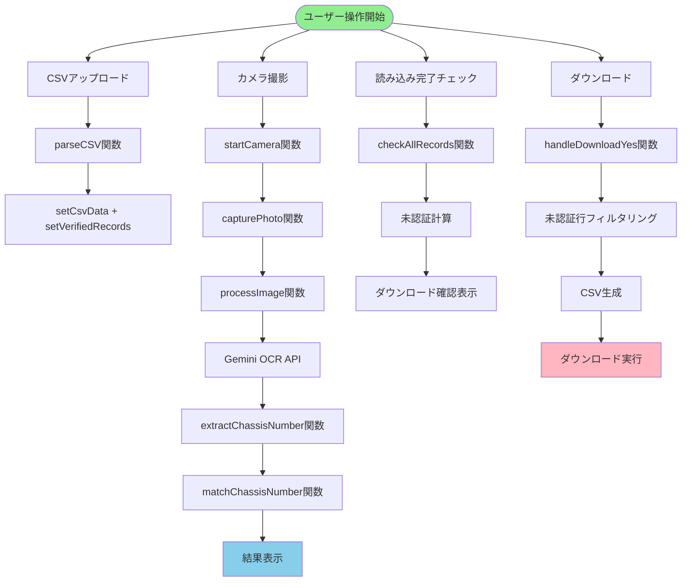

# 📊 CSV照合AI - シーケンス図

## 全体機能フロー

```mermaid
sequenceDiagram
    actor User as 👤 ユーザー
    participant UI as 🖥️ フロントエンド
    participant Camera as 📷 カメラAPI
    participant OCR as 🔍 Gemini OCR
    participant Logic as 🧠 照合ロジック
    participant Storage as 💾 ローカルストレージ

    User->>UI: 1. CSVファイルをアップロード
    UI->>Storage: CSVファイルを読み込み
    Storage-->>UI: CSVデータ (headers, rows)
    UI-->>User: ✅ CSV読み込み完了
    
    User->>UI: 2. カメラで書類撮影
    UI->>Camera: getUserMedia()
    Camera-->>UI: ビデオストリーム
    UI-->>User: カメラ画面表示
    User->>UI: 撮影ボタンをクリック
    UI->>Camera: キャプチャ処理
    Camera-->>UI: 画像データ
    
    UI->>OCR: 3. 画像OCR処理 (Gemini API)
    OCR-->>UI: テキスト抽出結果
    
    UI->>Logic: 4. 車台番号抽出
    Logic-->>UI: 車台番号
    
    UI->>Logic: 5. CSV照合処理
    Logic->>Logic: 正規化・比較
    Logic-->>UI: 照合結果
    
    alt 照合成功
        UI-->>User: ✅ 認証成功 (詳細データ表示)
        UI->>Storage: 認証記録を保存
    else 照合失敗
        UI-->>User: ⚠️ CSVに存在しない車台番号
    end
```

## 未認証チェック & ダウンロード機能

```mermaid
sequenceDiagram
    actor User as 👤 ユーザー
    participant UI as 🖥️ フロントエンド
    participant Logic as 🧠 照合ロジック
    participant Storage as 💾 認証記録
    participant Download as 📥 ダウンロード

    User->>UI: 「読み込み完了」ボタンをクリック
    UI->>Logic: 未認証項目チェック
    
    Logic->>Storage: 認証済み車台番号を取得
    Storage-->>Logic: 認証済みリスト
    
    Logic->>Logic: CSV全件 - 認証済み = 未認証
    
    alt 未認証あり
        Logic-->>UI: 未認証一覧 + showDownloadPrompt:true
        
        UI-->>User: ⚠️ 未認証 X件\n未認証車台番号一覧
        
        Note over UI,User: ダウンロード確認メッセージ表示
        UI-->>User: ファイルをダウンロードしますか？\n[はい] / [いいえ]
        
        alt ユーザーが「はい」を選択
            User->>UI: はいボタンクリック
            UI->>Logic: handleDownloadYes()
            Logic->>Logic: 未認証行をフィルタリング
            Logic->>Logic: CSV形式に変換
            Logic->>Download: ダウンロード処理
            Download-->>User: 未認証データ_YYYY-MM-DD.csv
            
            UI->>UI: showDownloadPromptをfalseに
            UI-->>User: ✅ ファイルをダウンロードしました
            
        else ユーザーが「いいえ」を選択
            User->>UI: いいえボタンクリック
            UI->>UI: handleDownloadNo()
            UI->>UI: showDownloadPromptをfalseに
            UI-->>User: (メッセージ非表示)
        end
        
    else 全件認証完了
        Logic-->>UI: 全て認証済み
        UI-->>User: 🎉 全件認証完了 X/X件
    end
```

## CSVアップロード & パース処理

```mermaid
sequenceDiagram
    participant User as 👤 ユーザー
    participant UI as 🖥️ UI
    participant Parser as 📄 CSV Parser
    participant State as 💾 State管理

    User->>UI: CSVファイル選択
    UI->>UI: ファイル読み込み (text())
    
    UI->>Parser: 3行目をヘッダーとしてパース
    Parser->>Parser: カンマ区切りで分割
    Parser->>Parser: ヘッダー配列作成
    
    Parser->>Parser: 4行目以降をデータ行としてパース
    Loop 各行
        Parser->>Parser: カンマ区切りで分割
        Parser->>Parser: ヘッダーとマッピング
        Parser->>Parser: 空行をスキップ
    end
    
    Parser-->>UI: {headers: [], rows: []}
    
    UI->>State: setCsvData()
    UI->>State: setVerifiedRecords([])
    
    UI-->>User: ✅ CSV読み込み: X件
```

## 車台番号照合ロジック

```mermaid
sequenceDiagram
    participant OCR as 🔍 OCR結果
    participant Extract as 🔤 抽出ロジック
    participant Match as 🎯 照合ロジック
    participant CSV as 📊 CSVデータ
    participant Result as 📋 結果

    OCR-->>Extract: テキスト抽出結果
    
    Extract->>Extract: 正規表現パターン1: /([A-Z0-9]{4,6}[-\s]?[0-9]{6,8})/i
    Extract->>Extract: 正規表現パターン2: /車台番号[:\s]*([A-Z0-9-]{10,})/i
    Extract->>Extract: 正規表現パターン3: /CHASSIS[:\s]*([A-Z0-9-]{10,})/i
    
    alt マッチ成功
        Extract-->>Match: 抽出された車台番号
        
        Match->>CSV: 車台番号列を検索
        CSV-->>Match: 車台番号列のインデックス
        
        Match->>Match: 車台番号を正規化\n(空白除去・大文字化)
        
        Loop CSVの各行
            Match->>Match: 行の車台番号を正規化
            Match->>Match: 完全一致・包含チェック
        end
        
        alt マッチ発見
            Match-->>Result: ✅ 照合成功 + データ
        
        else マッチなし
            Match-->>Result: ⚠️ CSVに存在しない
        end
        
    else マッチ失敗
        Extract-->>Result: ❌ 車台番号が見つからない
    end
```

## データ構造

```mermaid
classDiagram
    class Message {
        +string role
        +string content
        +string timestamp
        +boolean showDownloadPrompt
        +string[] unverifiedList
    }
    
    class CsvData {
        +string[] headers
        +Record[] rows
    }
    
    class VerificationRecord {
        +string chassisNumber
        +string timestamp
        +Record matchedData
    }
    
    class State {
        +Message[] messages
        +CsvData csvData
        +VerificationRecord[] verifiedRecords
        +boolean cameraActive
        +boolean loading
    }
    
    State --> Message
    State --> CsvData
    State --> VerificationRecord
    CsvData --> Record
    VerificationRecord --> Record
```

## 主要な関数呼び出しフロー

```mermaid
graph TB
    Start([ユーザー操作開始])
    
    Start --> CSV[CSVアップロード]
    Start --> Camera[カメラ撮影]
    Start --> Check[読み込み完了チェック]
    Start --> Download[ダウンロード]
    
    CSV --> ParseCSV[parseCSV関数]
    ParseCSV --> SetState[setCsvData + setVerifiedRecords]
    
    Camera --> StartCamera[startCamera関数]
    StartCamera --> CapturePhoto[capturePhoto関数]
    CapturePhoto --> ProcessImage[processImage関数]
    ProcessImage --> Gemini[Gemini OCR API]
    Gemini --> ExtractChassisNumber[extractChassisNumber関数]
    ExtractChassisNumber --> MatchChassisNumber[matchChassisNumber関数]
    MatchChassisNumber --> DisplayResult[結果表示]
    
    Check --> CheckAllRecords[checkAllRecords関数]
    CheckAllRecords --> CalcUnverified[未認証計算]
    CalcUnverified --> ShowDownloadPrompt[ダウンロード確認表示]
    
    Download --> HandleDownloadYes[handleDownloadYes関数]
    HandleDownloadYes --> FilterUnverified[未認証行フィルタリング]
    FilterUnverified --> CreateCSV[CSV生成]
    CreateCSV --> TriggerDownload[ダウンロード実行]
    
    style Start fill:#90EE90
    style DisplayResult fill:#87CEEB
    style TriggerDownload fill:#FFB6C1
```

